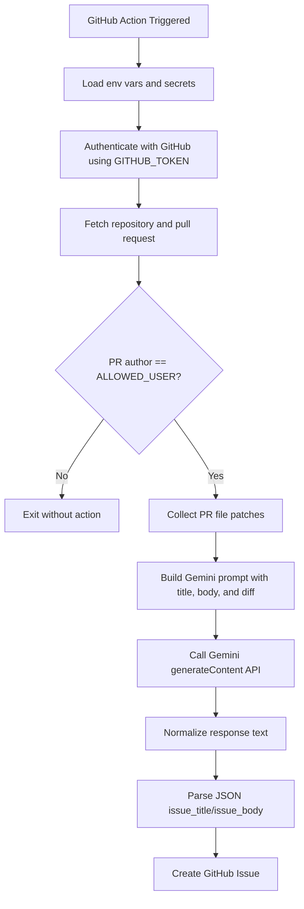

# PR Issue Logger AI

Turn pull requests into structured, trackable GitHub Issues automatically using Gemini-powered change summarization.

[](../../actions)
[](https://www.python.org/)
[](LICENSE)
[](https://ai.google.dev/)

> [!NOTE]
> This project is a lightweight Python automation utility that logs PR implementation details into GitHub Issues by combining GitHub API metadata with Gemini-generated summaries.

## Table of Contents

- [Title and Description](#pr-issue-logger-ai)
- [Features](#features)
- [Tech Stack & Architecture](#tech-stack--architecture)
- [Getting Started](#getting-started)
- [Testing](#testing)
- [Deployment](#deployment)
- [Usage](#usage)
- [Configuration](#configuration)
- [License](#license)
- [Contacts & Community Support](#contacts--community-support)

## Features

- Automatic PR diff ingestion from GitHub Pull Request metadata.
- Controlled execution using `ALLOWED_USER` to prevent unauthorized automation triggers.
- Intelligent PR-to-Issue transformation via Gemini model prompting.
- Strict JSON response contract from the model for predictable downstream parsing.
- Resilient markdown fence cleanup (` ```json ` and ` ``` ` stripping) prior to JSON decoding.
- Automatic issue creation with source traceability annotation (`Generated from PR #<number>`).
- Large diff protection with truncation guard to avoid over-sized prompts.
- Simple environment-driven configuration suitable for GitHub Actions and containerized runs.
- Minimal dependency footprint (`PyGithub`, `requests`, standard library).
- Easy extensibility for custom prompt engineering, templates, and issue labeling.

> [!IMPORTANT]
> The script exits early if the PR author does not match `ALLOWED_USER`, which is a critical safety gate for production repositories.

## Tech Stack & Architecture

### Core Stack

- **Language:** Python 3
- **APIs:** GitHub REST API (via `PyGithub`), Google Gemini API (`generateContent`)
- **Dependencies:**
  - `PyGithub` for repository, pull request, and issue operations
  - `requests` for Gemini API invocation
  - `json` and `os` from Python standard library

### Project Structure

```text
.
├── LICENSE
├── README.md
└── process_issue.py
```

### Key Design Decisions

- **Environment-variable first configuration:** designed for CI workflows and secret management.
- **Prompt-plus-diff pattern:** captures both PR metadata and raw file patches for contextual issue generation.
- **Contract-first model output:** requires exact JSON keys (`issue_title`, `issue_body`) to simplify parsing.
- **Security-first actor filtering:** enforces one authorized PR author before processing.
- **Minimal surface area:** single-purpose script to reduce operational complexity.

### Data Flow



> [!TIP]
> Keep prompts deterministic and constrained to strict JSON to improve reliability in CI pipelines.

## Getting Started

### Prerequisites

- Python `3.10+`
- GitHub repository with Actions enabled
- A valid GitHub token with permission to read PRs and create issues
- A Gemini API key
- Repository secrets configured:
  - `GITHUB_TOKEN`
  - `GEMINI_API_KEY`
  - `ALLOWED_USER`

> [!WARNING]
> If `ALLOWED_USER` is missing or malformed, `.strip().lower()` operations can fail. Always set this variable explicitly.

### Installation

```bash
git clone https://github.com/<your-org>/<your-repo>.git
cd Pull_requests-issues-github-actions-gemeniAI
python -m venv .venv
source .venv/bin/activate  # Windows: .venv\Scripts\activate
pip install --upgrade pip
pip install PyGithub requests
```

## Testing

Run these commands locally before integrating into CI:

```bash
python -m py_compile process_issue.py
python -m pytest -q
python -m pip check
```

> [!NOTE]
> This repository currently does not ship test modules by default. `pytest` may report `no tests ran` unless you add project-specific tests.

## Deployment

### Production Deployment via GitHub Actions

1. Add repository secrets:
   - `GEMINI_API_KEY`
   - `ALLOWED_USER`
2. Ensure the workflow runtime exports required environment variables:
   - `GITHUB_TOKEN`
   - `REPOSITORY`
   - `PR_NUMBER`
3. Execute `process_issue.py` as a workflow step after PR events.

Example workflow step:

```yaml
- name: Generate issue from PR
  env:
    GITHUB_TOKEN: ${{ secrets.GITHUB_TOKEN }}
    GEMINI_API_KEY: ${{ secrets.GEMINI_API_KEY }}
    ALLOWED_USER: ${{ secrets.ALLOWED_USER }}
    REPOSITORY: ${{ github.repository }}
    PR_NUMBER: ${{ github.event.pull_request.number }}
  run: python process_issue.py
```

### Containerization (Optional)

```dockerfile
FROM python:3.11-slim
WORKDIR /app
COPY process_issue.py /app/process_issue.py
RUN pip install --no-cache-dir PyGithub requests
CMD ["python", "process_issue.py"]
```

> [!CAUTION]
> Do not bake secrets into container images. Inject them only at runtime via environment variables or secret stores.

## Usage

### Basic Execution

```bash
export GITHUB_TOKEN="ghp_xxx"
export GEMINI_API_KEY="AIza..."
export REPOSITORY="owner/repo"
export PR_NUMBER="123"
export ALLOWED_USER="trusted-contributor"

python process_issue.py
```

### Programmatic Behavior Walkthrough

```python
# 1) Authenticate with GitHub
from github import Github, Auth
auth = Auth.Token(gh_token)
gh = Github(auth=auth)

# 2) Load PR and validate actor
repo = gh.get_repo(repo_name)
pr = repo.get_pull(number=pr_number)
if pr.user.login.strip().lower() != allowed_user:
    exit(0)  # unauthorized actor guard

# 3) Build prompt from PR metadata + diff
# 4) Call Gemini and parse strict JSON
# 5) Create issue with traceability footer
```

## Configuration

Configuration is driven entirely by environment variables.

| Variable | Required | Description | Example |
|---|---:|---|---|
| `GITHUB_TOKEN` | Yes | GitHub access token used by `PyGithub` | `ghp_xxxxx` |
| `GEMINI_API_KEY` | Yes | API key for Gemini `generateContent` endpoint | `AIza...` |
| `REPOSITORY` | Yes | Target repository in `owner/name` format | `octo-org/octo-repo` |
| `PR_NUMBER` | Yes | Pull request number to process | `42` |
| `ALLOWED_USER` | Yes | Lowercased trusted GitHub login allowed to trigger issue generation | `trusted-user` |

### `.env` Example

```env
GITHUB_TOKEN=ghp_xxxxx
GEMINI_API_KEY=AIzaSyxxxx
REPOSITORY=owner/repository
PR_NUMBER=17
ALLOWED_USER=trusted-user
```

### Runtime Flags

This script currently does **not** expose CLI startup flags; all runtime behavior is controlled through environment variables.

### Configuration File Structure

There is no dedicated YAML/JSON config file at present. For CI/CD usage, define configuration through workflow `env` and repository secrets.

## License

This project is distributed under the **MIT License**. See [`LICENSE`](LICENSE) for full terms.

## Contacts & Community Support

## Support the Project

[](https://www.patreon.com/OstinFCT)
[](https://ko-fi.com/fctostin)
[](https://boosty.to/ostinfct)
[](https://www.youtube.com/@FCT-Ostin)
[](https://t.me/FCTostin)

If you find this tool useful, consider leaving a star on GitHub or supporting the author directly.
